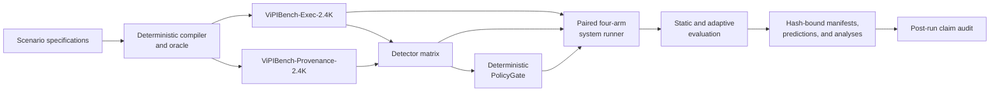

# ViPIBench Guardrail

> An evidence-gated research repository for Vietnamese context-aware
> prompt-injection detection and deterministic policy enforcement in LLM and
> RAG systems.

[](pyproject.toml)
[](LICENSE.md)
[](docs/data_card.md)
[](LICENSE.md)

ViPIBench Guardrail is a reproducible research codebase for studying whether
prompt-injection defenses can reason about **what content says**, **where it
came from**, **which role supplied it**, and **whether the requested action is
authorized**. It combines executable benchmark generation, controlled
provenance contrasts, detector baselines, a deterministic policy layer, paired
system evaluation, bounded adaptive attack search, and fail-closed evidence
controls.

The repository is deliberately strict about what counts as evidence. Synthetic
fixtures and local tests establish covered engineering behavior; they are not
model-quality findings. Notebook metadata does not prove that a hosted
accelerator was allocated. Readiness receipts do not prove that a confirmatory
run completed. Every empirical claim must remain bound to the exact source,
configuration, runtime observations, raw artifacts, and post-run audit that
support it.

> [!IMPORTANT]
> This repository is a private, source-focused projection. It does not, by
> itself, establish a completed confirmatory run, production security,
> public-release authorization, or an open-source license. Generated runtime
> receipts, historical audit traces, and hosted execution decisions remain in
> the separate private integration bundle.

## Contents

- [Why this project exists](#why-this-project-exists)
- [Research scope](#research-scope)
- [System design](#system-design)
- [Locked evaluation surface](#locked-evaluation-surface)
- [Repository structure](#repository-structure)
- [Quick start](#quick-start)
- [Local verification](#local-verification)
- [Command-line interface](#command-line-interface)
- [Private Colab integration](#private-colab-integration)
- [Reproducibility and evidence](#reproducibility-and-evidence)
- [Public and private boundaries](#public-and-private-boundaries)
- [Documentation](#documentation)
- [Contributing](#contributing)
- [Citation](#citation)
- [License](#license)

## Why this project exists

Prompt injection is not only a text-classification problem. The same sentence
can be harmless when supplied by an authorized user and dangerous when it is
recovered from an untrusted document, tool result, or retrieved page. A defense
that flattens every message into plain text can discard precisely the context
needed to make the correct decision.

This project separates three questions that are often conflated:

1. **Detection:** Does the input exhibit evidence of an instruction-injection
   attempt?
2. **Provenance:** Which source and role supplied the instruction, and is that
   binding trustworthy?
3. **Authorization:** Even if the instruction appears benign, is the requested
   action permitted?

The learned detector is therefore not the final authority. Its score is one
input to a deterministic policy layer whose authorization behavior can be
tested independently.

The implementation emphasizes five properties:

1. **Executable labels by construction.** Structured scenarios compile into
   validated episodes with deterministic oracle behavior.
2. **Controlled provenance contrasts.** Counterfactual pairs hold surface
   content constant while changing content-to-source bindings.
3. **Leakage-resistant evaluation.** Training, development-time selection, and
   final evaluation remain separate.
4. **Fail-closed execution.** Missing evidence, stale hashes, incompatible
   runtime state, malformed trajectories, or non-finite numerics stop the
   affected path.
5. **Claim discipline.** Fixtures, local verification, hosted telemetry,
   empirical results, and production claims remain distinct evidence classes.

## Research scope

### 1. Executable benchmark

ViPIBench-Exec-2.4K contains 2,400 synthetic executable episodes across 80
families and four application domains. The compiler produces structured
records, matched pairs, hard negatives, and deterministic validation artifacts
from declared scenario specifications.

The benchmark establishes controlled structural coverage. It does not claim
to measure the natural prevalence of prompt injection or the full distribution
of real Vietnamese LLM traffic.

### 2. Provenance benchmark

ViPIBench-Provenance-2.4K contains 1,200 counterfactual pairs. Within each pair,
the semantic text multiset and role/trust multiset remain identical while the
content-to-source binding and correct authorization outcome change.

This design tests whether a detector uses provenance rather than surface text
alone. It supports text-only, role-only, text-plus-role, and provenance-aware
views under the same paired contract.

### 3. Defense decomposition

The same frozen episodes can be evaluated under four paired system arms:

- no defense;
- detector only;
- deterministic policy only; and
- detector plus deterministic policy.

The deterministic `PolicyGate` checks authorization, capability, tool
arguments, provenance, and detector thresholds. Free-form model output cannot
waive these checks.

### 4. Adaptive evaluation

The confirmatory system design includes an equal-budget comparison between
static and feedback-guided attack search. Candidate generation, target-agent
trajectories, detector artifacts, checkpoints, and analyses remain source- and
configuration-bound.

This is a bounded experimental stress test. It is not a proof of universal
robustness, optimal attack discovery, or production safety.

## System design



The language models are measurement infrastructure inside the experiment.
They do not select the scientific protocol, authorize external actions, change
the evidence rules, or decide which result should be reported. Deterministic
code owns those decisions, and unknown state fails closed.

## Locked evaluation surface

The authoritative values live in the project configurations and manifests.
This table is an orientation aid, not a substitute for those files.

| Component | Declared surface |
|---|---|
| ViPIBench-Exec | 2,400 episodes across 80 families |
| Frozen family split | 48 train, 16 development, and 16 test families |
| Frozen episode split | 1,440 train, 480 development, and 480 test episodes |
| ViPIBench-Provenance | 1,200 pairs: 600 train, 200 development, and 400 test pairs |
| Final static evaluation | 480 episodes across four paired arms, or 1,920 trajectories |
| Attack search | 240 injection episodes × 2 strategies × 10 candidates × 3 defended arms |
| Maximum confirmatory total | 16,320 trajectories, excluding bounded capacity warm-ups |
| Target agent | Revision-pinned Qwen3-8B under deterministic decoding |
| Adaptive generator | Revision-pinned Qwen3-4B under a bounded proposal contract |
| Confirmatory encoder precision | FP32 |
| Local Python | `>=3.11,<3.13` |
| Hosted profile | Exact allowlisted NVIDIA A100 80GB contract; no silent fallback |

The active protocol, runtime lineage, model revisions, and remaining external
gates can change after a verified amendment. Read the bound configurations and
the private integration-bundle receipts instead of treating this README as a
live execution receipt.

## Repository structure

```text
.
|-- configs/                         # Benchmark, model, experiment, and runtime contracts
|-- data/                            # Synthetic benchmark inputs and provenance metadata
|-- docs/                            # Reviewed design, protocol, schema, and threat-model docs
|-- notebooks/                       # Source notebooks without executed outputs
|-- outputs/                         # Retained schemas; generated receipts stay local
|-- scripts/                         # Environment, packaging, and verification tools
|-- src/vipibench/                   # Python package and CLI implementation
|-- tests/                           # Unit, integration, contract, and regression tests
|-- .env.example                     # Non-secret local defaults
|-- .gitattributes                   # Cross-platform text normalization
|-- .gitignore                       # Cache, secret, runtime, and private-boundary rules
|-- LICENSE.md                       # Current internal-research license notice
|-- pyproject.toml                   # Package metadata and tool configuration
`-- README.md                        # Repository entry point
```

This directory is the source-repository root. A private hosted-runtime bundle
may embed this repository beside an outer operator notebook and bootstrap
controller, but those integration files are not part of the standalone GitHub
source tree. Generated outputs, historical audit/research traces, thesis
reports, local status ledgers, and hash-bound transfer manifests are
intentionally excluded by `.gitignore`; the original local bundle remains the
authoritative evidence archive.

## Quick start

The local workflow exercises engineering contracts only. It does not allocate
hosted hardware, spend money, upload data, or start a confirmatory run.

### Requirements

- Python 3.11 or 3.12;
- Git; and
- PowerShell 7 on Windows, or a POSIX-compatible shell on Linux/macOS.

Use a verification environment outside the repository. This avoids adding a
virtual environment, bytecode, or dependency metadata to a hash-bound source
tree.

### Windows PowerShell

From the repository root:

```powershell
$VerifyRoot = Join-Path ([IO.Path]::GetTempPath()) ("vipibench-verify-" + [guid]::NewGuid())
py -3.11 -m venv $VerifyRoot
$Python = Join-Path $VerifyRoot "Scripts\python.exe"

& $Python -m pip install --upgrade pip
& $Python -m pip install -r requirements.lock
& $Python -m pip install --no-deps .

$env:PYTHONPATH = (Resolve-Path -LiteralPath src).Path
$env:PYTHONDONTWRITEBYTECODE = "1"

& $Python -m vipibench.cli version
```

### Linux or macOS shell

From the repository root:

```bash
VERIFY_ROOT="$(mktemp -d)/vipibench-verify"
python3.11 -m venv "$VERIFY_ROOT"
PYTHON="$VERIFY_ROOT/bin/python"

"$PYTHON" -m pip install --upgrade pip
"$PYTHON" -m pip install -r requirements.lock
"$PYTHON" -m pip install --no-deps .

export PYTHONPATH="$(pwd)/src"
export PYTHONDONTWRITEBYTECODE=1

"$PYTHON" -m vipibench.cli version
```

The source-only checkout is intentionally usable without private runtime
receipts. The default test command marks evidence-bound checks with
`private_integration`; they run automatically when the complete private bundle
and its generated evidence are present, and otherwise skip with an explicit
reason. This keeps a fresh clone honest instead of treating missing evidence as
readiness. In the complete private integration bundle, run
`vipibench doctor --project-root .` to audit requirement ownership and active
coverage. A passing result is an engineering-contract check, not confirmatory
launch readiness.

## Local verification

Run the following source-level gates from the repository root with the
verification environment active:

```powershell
& $Python -m ruff check --no-cache src tests scripts
& $Python -m pytest -q -p no:cacheprovider
& $Python -m vipibench.cli version
```

For the separate private integration bundle, where the outer operator files
and generated evidence are available:

```powershell
& $Python -m pytest -m private_integration -q -p no:cacheprovider
& $Python -m vipibench.cli doctor --project-root .
```

Use a temporary output directory for checks that emit receipts:

```powershell
$CheckRoot = Join-Path ([IO.Path]::GetTempPath()) ("vipibench-checks-" + [guid]::NewGuid())
New-Item -ItemType Directory -Path $CheckRoot | Out-Null

& $Python -m vipibench.cli verify-policy-gate `
  --output (Join-Path $CheckRoot "policy_gate_verification.json")

& $Python -m vipibench.cli validate-exec-experiment-protocol `
  --project-root . `
  --output (Join-Path $CheckRoot "experiment_protocol_validation.json")

& $Python -m vipibench.cli validate-confirmatory-analysis `
  --project-root . `
  --output (Join-Path $CheckRoot "confirmatory_analysis_validation.json")

& $Python -m vipibench.cli scan-secrets `
  --root . `
  --output (Join-Path $CheckRoot "secret_scan.json")
```

The full artifact-manifest, confirmatory-holdout, preflight, and upload gates
belong to the separate private integration bundle because they bind generated
runtime evidence that is deliberately not committed here. Any failed required
gate is a No-Go for a release claim. Do not hand-edit a retained receipt to
make it pass; regenerate derived artifacts with their owning command after the
complete candidate is green.

## Command-line interface

After installation:

```bash
vipibench --help
```

The CLI exposes explicit commands for:

- benchmark compilation, validation, freezing, and shortcut audits;
- provenance-contrast compilation and paired identity audits;
- deterministic oracle and PolicyGate verification;
- TF-IDF, public-detector, and encoder-matrix execution;
- threshold calibration and held-out prediction analysis;
- static four-arm and adaptive attack-search evaluation;
- runtime, resource, notebook, and environment checks;
- artifact-manifest, authorization, and provenance verification; and
- post-run raw-manifest generation and claim auditing.

Use `vipibench COMMAND --help` before a command that writes data or evidence.
The CLI does not silently replace a requested model, runtime profile, precision
mode, or scientific configuration.

## Private Colab integration

The standalone source repository is intentionally distinct from the pristine
private Colab transfer bundle. In the integration workspace, the outer
`RUN_EXPERIMENT.ipynb` is the sole operator-facing notebook and `bootstrap.py`
provides isolated staging, explicit authorization gates, source verification,
and durable snapshot control.

The inner notebooks in this repository are workflow components, not independent
public launch entry points.

The hosted workflow requires, among other controls:

- explicit, run-scoped authorization for upload and paid compute;
- the registered accelerator profile and CUDA-only model placement;
- fresh source and dependency compatibility receipts;
- a manifest-derived upload payload;
- durable, checksum-verified snapshots; and
- terminal post-run evidence and claim audits.

Do not initialize Git inside a pristine experimental transfer bundle. Maintain
the GitHub repository in a separate checkout, review its staged file set, and
then construct or refresh the private integration bundle through the owning
manifest workflow.

Maintainers inside the private integration workspace use the project-owned
commands only after the intended source candidate is green:

```powershell
python -m vipibench.cli build-artifact-manifest --project-root .
python -m vipibench.cli verify-artifact-manifest --project-root .
python ..\bootstrap.py --build-bundle-manifest --bundle ..
python ..\bootstrap.py --verify-bundle-manifest --bundle ..
python ..\bootstrap.py --verify-upload-inventory --bundle ..
```

The outer commands require the exact private integration layout and are not
expected to pass in a standalone GitHub clone.

## Reproducibility and evidence

### Source and configuration binding

The pipeline binds execution to:

- immutable model, tokenizer, and dataset revisions;
- normalized data and frozen split hashes;
- scientific configuration and runtime-profile hashes;
- source and artifact manifests;
- authorization records and runtime observations;
- exact checkpoints, predictions, trajectories, thresholds, and analyses.

Changing a bound input invalidates dependent readiness, resume, analysis, or
release artifacts.

### Resume safety

A completed stage is skipped only after its identity, source bindings,
prerequisites, marker, and output hashes revalidate. Incomplete work is not
converted into success. Durable restore re-hashes retained content and does not
silently combine incompatible lineages.

### Statistical discipline

- Model selection and early stopping use development evidence only.
- Final-holdout observations do not tune thresholds or runtime decisions.
- Paired units remain paired in uncertainty estimation.
- Generated variants are not treated as independent experimental units.
- Planned, attempted, completed, valid, failed, and excluded counts remain
  distinct.
- Exploratory findings are not promoted into confirmatory claims.

### Evidence status

| Evidence class | What it can support | What it cannot support |
|---|---|---|
| Static source and schema checks | Structural consistency of the covered surface | Runtime success or detector quality |
| Deterministic fixtures | Covered oracle, policy, and orchestration behavior | Confirmatory model or system findings |
| Notebook contract and metadata | Intended stage topology | Actual accelerator allocation or execution |
| Local readiness receipts | Compatibility of the exact bound local candidate | Hosted runtime identity, continuity, or throughput |
| Live stage telemetry and artifacts | Observations from the exact complete, hash-valid stage | Eligibility of the full run or broader generalization |
| Passing post-run claim audit | Claims explicitly covered by retained eligible artifacts | Universal robustness or production safety |

The authoritative claim mapping is maintained in the private integration
bundle. When a required artifact is absent or stale, the corresponding
conclusion remains unverified.

## Public and private boundaries

No public release is currently authorized. If a public source release is later
approved, its candidate surface would normally include reviewed implementation
source, tests, schemas, non-secret configurations, synthetic research data, and
protocol documentation.

A public candidate must not contain:

- credentials, tokens, private prompts, or real `.env` files;
- direct identifiers or unnecessary personal information;
- local absolute paths or machine-specific metadata;
- model weights, caches, virtual environments, or bytecode;
- generated runtime output or executed notebook output;
- private infrastructure telemetry;
- stale receipts presented as current evidence; or
- historical audit material that has not passed a publication review.

Before initializing Git, add a project-specific `.gitignore` and verify the
exact staged file set. Ignore rules are not a security review: run a fresh
secret and identifier scan, inspect `git diff --cached`, and never use
`git add -f` to bypass the release boundary.

## Documentation

| Document | Purpose |
|---|---|
| [`docs/implementation_contract.md`](docs/implementation_contract.md) | Components, invariants, and verification ownership |
| [`docs/data_card.md`](docs/data_card.md) | Dataset construction, intended use, and limitations |
| [`docs/model_card.md`](docs/model_card.md) | Detector and target-model roles and limitations |
| [`docs/threat_model.md`](docs/threat_model.md) | Trust boundaries, assets, adversaries, and mitigations |
| [`configs/experiments/exec_system.yaml`](configs/experiments/exec_system.yaml) | Locked system-evaluation design |
| [`configs/experiments/confirmatory_analysis.yaml`](configs/experiments/confirmatory_analysis.yaml) | Estimands, uncertainty, and decision rules |

## Contributing

This is a controlled research codebase rather than an open community project.
Before proposing a change:

1. state which scientific or engineering contract the change affects;
2. preserve frozen data, source bindings, and evidence classifications;
3. add or update focused regression coverage;
4. run the full applicable verification surface; and
5. record any residual uncertainty or invalidated receipt.

Do not weaken a threshold, runtime, authorization, manifest, or evidence gate
merely to obtain a passing status.

## Citation

A formal public citation record has not been released. Do not invent
authorship, a DOI, or publication metadata. For internal reproducibility,
identify the exact repository commit, configuration hashes, and access date.
Add `CITATION.cff` only after the release owner approves definitive attribution
and citation metadata.

## License

This repository is **not currently open source**. The existing
[`LICENSE.md`](LICENSE.md) grants no public software or dataset license, and the
current [`data/release_decision.yaml`](data/release_decision.yaml) does not
authorize public release.

A private GitHub repository may be useful as a versioned working copy, but any
external upload must first satisfy the project's authorization and privacy
process. Public visibility requires a component-level license review, a clean
publication projection, an updated release decision, and fresh deterministic
verification.

---

Built for inspectable research: every important claim should be traceable to
source, configuration, retained evidence, and a verifier.
